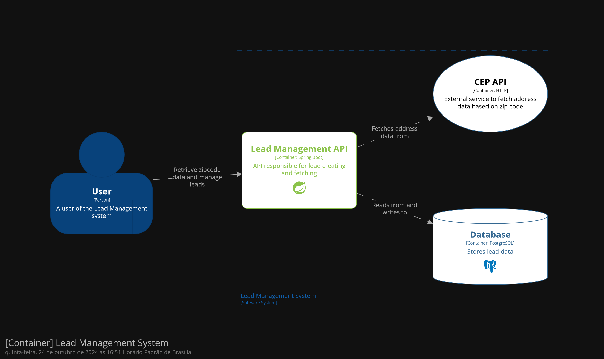
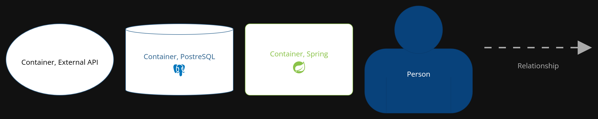

# Lead Management API
API responsável por gerenciar leads de uma empresa.

Este projeto foi desenvolvido para demonstrar a utilização de Clean Architecture, TDD e princípios SOLID.

## Tecnologias
- Spring Boot 3
- Java 21
- Gradle
- Docker
- Postgres
- Wiremock

## Docker Compose
Para rodar a aplicação, basta executar o comando `docker-compose up` na raiz do projeto, com isso, será iniciado o
banco de dados Postgres e a API mockada de CEPs com Wiremock, na porta 8080.

## Architecture

